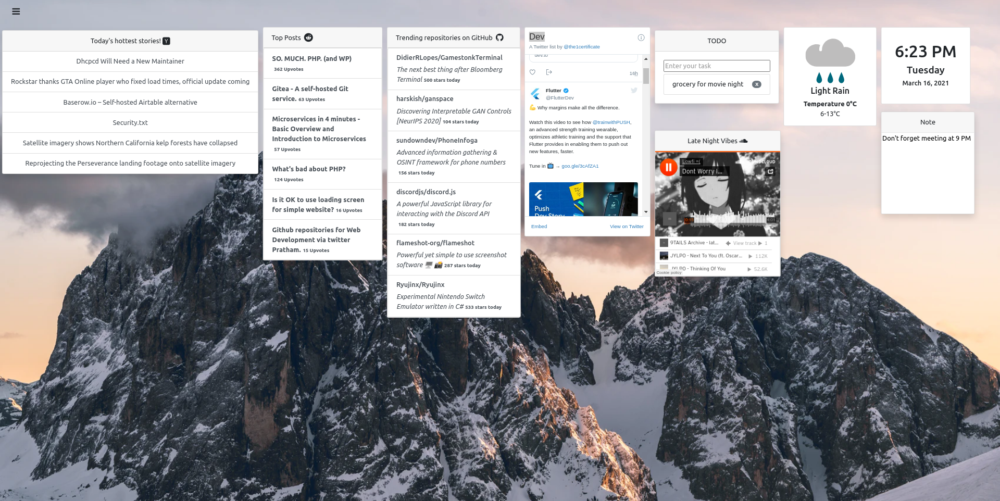

<h1 align="center">
  <br>
  
  <br>
</h1>

<h4 align="center"> <b>enOne</b> is platform for building your own dashboard, with various of 3rd party widgets.</h4>

<p align="center">
  <a href="https://opensource.org/licenses/MIT"></a>
  <a href="https://github.com/Naereen/badges"></a>
  <a href="https://github.com/facebook/jest"></a>
  <a href="https://www.electronjs.org"></a>
</p>

<p align="center"> <b>enOne</b> is still under testing and in <b>PRE-RELEASE</b> phase, your feedback is much appreciated!</p>



## Setup

The following commands installs and runs the application

```bash
# Clone the repository
$ git clone https://github.com/YasserYka/enOne.git
# go to enOne directory
$ git clone https://github.com/YasserYka/enOne-widgets.git
# install dependencies
$ npm install
# start the application
$ npm start
```

## Widget

To develop your own widget or check out existing widgets, please go to the [widgets repository](https://github.com/YasserYka/enOne-widgets)!

## Contribution

Any kind of contribution is more than welcome! feel free to contact me, fix issues, open an issue or suggest a feature. 

To submit a pull request please follow these steps

1. Fork it
2. Clone it
3. Create a new branch
4. Commit changes to the new branch
5. Push changes to your fork
6. Submit a Pull request
